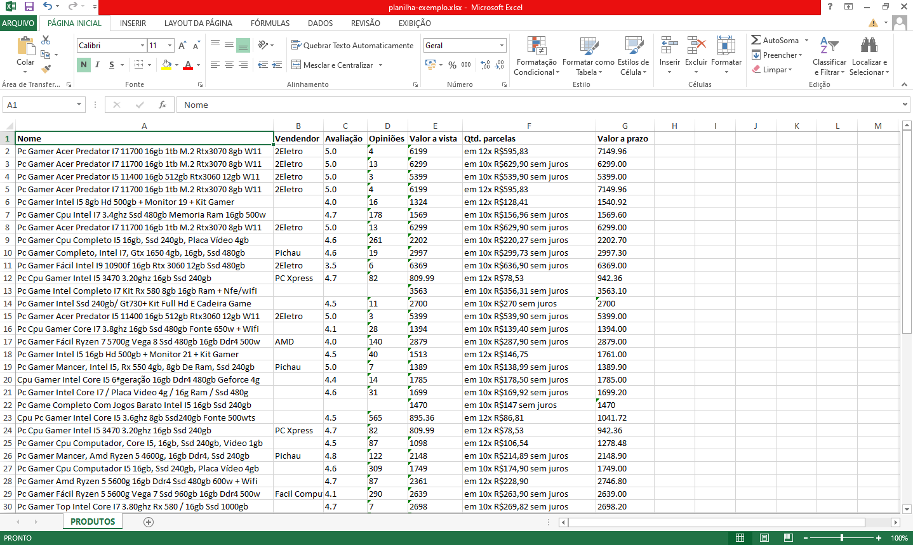

# WebScraping
[](https://github.com/ualashenr/-WebScraping/blob/master/LICENSE) 

# Sobre o projeto
Realiza um WebScraping que busca dados de produtos no Mercado Livre, como nome, vendendor, número de parcelas, valor a vista, valor a prazo, entre outros. Converte todos dados para uma planilha no excel.

# Tecnologias utilizadas

## Back-end
* Java
* Maven
* Edge driver

## Postman


# Como executar o projeto

Ao executar o projeto, ele abrirá o navegador Microsoft Edge e fara uma busca no mercado livre por "pc gamer", 
é importante não interagir com o navegador durante esse procedimento. Ao finalizar o navegador será fechado e será criada uma planilha chamada "produtos" com os dados dos produtos na pasta de arquivos.

## Back-end

Pré-requisitos: Java 17

```bash
# clonar repositório
git clone https://github.com/Yse4/yseCommecer

# entrar na pasta do projeto back end
cd backend

# executar o projeto
./mvnw spring-boot:run
```
# Autor
Ualas Henrique Bezerra Filho

https://www.linkedin.com/in/ualas-henrique-54678827a/
